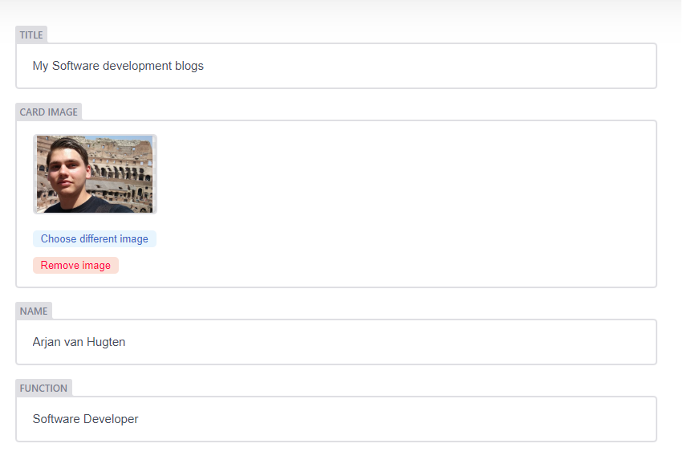
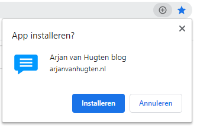

In this blog I want to tell you about my top ten gatsby plugins, all the plugins are used for this website. I really enjoyed creating a website with gatsby, there are many plugins that you can use for your site. They only require some configuration. Creating my first gatsby website was a great experience for me due to all this plugins that I could use.

### 1. React helmet
With this plugin you can easily add metadata to your site, this plugin adds gatsby support for the [react helmet react component](https://github.com/nfl/react-helmet). This includes title, description, open graph data (for social sharing) and twitter data (for link sharing on twitter). This plugin is included in the gatsby starter and I think it is a clean and nice way to define your metadata.

Helmet configuration:
```jsx
<Helmet
    htmlAttributes={{lang}}
    title={title}
    titleTemplate={`%s | ${site.siteMetadata.title}`}
    meta={[
        { name: `description`, content: metaDescription },
        { property: `og:title`, content: title },
        { property: `og:description`, content: metaDescription },
        { property: `og:type`, content: `website` },
        { name: `twitter:card`,content: `summary` },
        { name: `twitter:creator`,content: site.siteMetadata.author },
        { name: `twitter:title`,content: title },
        { name: `twitter:description`,content: metaDescription },
    ].concat(meta)}
/>
``` 

### 2. Gatsby image & Transformer sharp & Plugin sharp
The next on my list are three plugins combined. They also come with your gatsby starter. These plugins are used to make it possible to query images with graphql and provide image loading techniques for your website. This optimizes the loading of images on your site. 

You just have to add the pictures to your project and the folder that contains the images need to be registered in the gatsby config to your filesystem with the 'gatsby-source-filesystem' plugin. Then you can query the image and show it with the gatsby image element.

```javascript
export const query = graphql`
  query {
    file(relativePath: { eq: "images/my-image.png" }) {
      childImageSharp {
        fluid {
          ...GatsbyImageSharpFluid
        }
      }
    }
  }
`
```

```jsx
import Img from "gatsby-image"

export default ({ data }) => (
  <div>
    
  </div>
)
```

### 3. Algolia
I wanted to add a search on my site so I began looking for a search implementation with gatsby. Then I came on the algolia with gatsby tutorial [page](https://www.gatsbyjs.org/docs/adding-search-with-algolia/). Algolia is a search as a service solution that can be integrated in Gatsby with the gatsby algolia plugin. 

The gatsby plugin makes it possible to push data to Algolia with graphql queries. This can be configured in a custom javascript file. Like the example below from my blog.

First it queries all the blogs from my site. This takes the frontmatter variables and a part of the content. The next step is to flatten the data to make it usable for algolia. Then you can set some settings for the index. I added the searchable attributes because I don't want people to search in the blog date field. 

After specifying the content that needs to be indexed you can use this in your gatsby config. You need to add the algolia plugin to your plugins and specifiy the application id, api key and queries. After this your Algolia index is configured and you can use it in your gatsby site.

```javascript
const blogsQuery = `{
  blogs: allMarkdownRemark(filter: { fileAbsolutePath: { regex: "/blogs/" } }) {
      edges {
          node {
              objectID: id
              frontmatter {
                  title
                  date(formatString: "MMMM DD, YYYY")
                  intro
                  path
              }
              excerpt(pruneLength: 5000)
          }
      }
  }
}`
  
const flatten = arr => arr.map(({ node: { frontmatter, ...rest } }) => ({
    ...frontmatter,
    ...rest,
}))

const settings = { 
    attributesToSnippet: [`excerpt:20`],
    searchableAttributes : [
        'title,path',
        'intro',
        'excerpt',
    ],
}

const queries = [
{
    query: blogsQuery,
    transformer: ({ data }) => flatten(data.blogs.edges),
    indexName: `Blogs`,
    settings,
},
]

module.exports = queries
```

```javascript
const queries = require("./src/utils/algolia")
require("dotenv").config()

module.exports = {
  plugins: [
    {
      resolve: `gatsby-plugin-algolia`,
      options: {
        appId: process.env.GATSBY_ALGOLIA_APP_ID,
        apiKey: process.env.ALGOLIA_ADMIN_KEY,
        queries,
      },
    },
  ],
}
```

### 4. Remark
Remark is a plugin to parse your markdown files and make it possible to query them and use them in your site. This can be configured by adding the markdown files with the 'gatsby-source-filesystem' plugin. Then you can use the remark plugin to make them possible to query. In my config I used some additional plugins for adding code syntax highlighting and relative image paths.

The next thing you can do is creating pages for the markdown files. This can be done in the gatsby node file, with the 'createPages' function. With this plugin you can easily add markdown files with content, for example for blogs site like this one. 

```javascript
module.exports = {
  plugins: [
    {
      resolve: `gatsby-source-filesystem`,
      options: {
        name: `blogs`,
        path: `${__dirname}/blogs`,
      },
    },
    {
      resolve: `gatsby-transformer-remark`,
      options: {
          plugins: [
              'gatsby-remark-relative-images',
              {
                  resolve: `gatsby-remark-images`,
              },
              {
                resolve: `gatsby-remark-prismjs`,
                options: {
                  classPrefix: "language-",
                  inlineCodeMarker: null,
                  showLineNumbers: false,
                  noInlineHighlight: false,
                },
              },
          ],
      },
    },
  ],
}
``` 

```javascript
exports.createPages = async ({ actions, graphql, reporter }) => {
  const { createPage } = actions
  const blogPostTemplate = path.resolve(`src/templates/blog.js`)
  const result = await graphql(`
    {
      allMarkdownRemark(
        sort: { order: DESC, fields: [frontmatter___date] }
        limit: 1000
        filter: { fileAbsolutePath: {regex: "/blogs/"} }
      ) {
        edges {
          node {
            frontmatter {
              path
            }
          }
        }
      }
    }
  `)

  // Handle errors
  if (result.errors) {
    reporter.panicOnBuild(`Error while running GraphQL query.`)
    return
  }

  result.data.allMarkdownRemark.edges.forEach(({ node }) => {
    createPage({
      path: node.frontmatter.path,
      component: blogPostTemplate,
      context: {},
    })
  })
}
```

### 5. Breadcrumb
For my site I wanted a breadcrumb, so before implementing I began searching for a gatsby plugin that has this functionality. And of course I found this plugin. It can be setup and used really easily. You just have to add the plugin to your config with a few settings. I used the auto generate option to generate the breadcrumbs instead of tracking the clicks and creating the breadcrumb from it.

The next step after configuring the breadcrumb is showing it on a page. You can get it from the pageContext in the react page component. Then you can pass the crumbs to your custom breadcrumb component or use the breadcrumb component that comes with the plugin.

```javascript
module.exports = {
  plugins: [
    {
      resolve: `gatsby-plugin-breadcrumb`,
      options: {
        useAutoGen: true,
        autoGenHomeLabel: `Home`,
      },
    },
  ],
}
```

```jsx
import Breadcrumb from '../components/general/breadcrumb'
import Layout from "../components/layout/layout"
import SEO from "../components/layout/seo"

export default ({ pageContext }) => {
  const { breadcrumb: { crumbs } } = pageContext

  return (
    <Layout>
      <SEO title={frontmatter.title} />
        <div className="container">
          <Breadcrumb crumbs={crumbs} />
        </div>
    </Layout>
  )
}
```

### 6. Netlify CMS
The other thing I wanted to add to my personal site is a nice CMS. Because I didn't like all the static text in my components. So I went looking for a CMS to use and found the netlify CMS that can be integrated with the gatsby netlify cms plugin. For this plugin you need to add a 'config.yml' in the '/static/admin' folder. Afterwards you can query the markdown files in your pages and get the values from the frontmatter. 



For the previews I needed to create some special components as seen in the code below. This was needed because static queries weren't possible in the previews and some other problems I got into.

```yml
backend:
  name: github
  repo: ArjanvHugten/ArjanvanHugten.nl
  
media_folder: static/images
public_folder: /images

display_url: https://arjanvanhugten.nl
site_url: https://arjanvanhugten.nl
  
collections:
  - name: "homepage"
    label: "Homepage"
    files:
      - file: "static/home/index.md"
        name: "homepage"
        label: "Homepage"
        fields:
          - { label: "Template Key", name: "templateKey", widget: "hidden", default: "homepage" }
          - { label: "Title", name: "title", widget: "string" }
          - { label: "Card image", name: "cardImage", widget: "image" }
          - { label: "Name", name: "name", widget: "string" }
          - { label: "Function", name: "function", widget: "string" }
          - { label: "Description", name: "description", widget: "text" }
          - { label: "Tech stack", name: "techstack", widget: "list", fields: [{ label: "Label", name: "label", widget: "string" }]}
          - { label: "Birthdate", name: "birthdate", widget: "datetime" }
          - { 
            label: "Socials", 
            name: "socials",
            widget: "list", 
            fields: [
              { label: "Label", name: "label", widget: "string" },
              { label: "Icon", name: "icon", widget: "string" },
              { label: "Link URL", name: "linkURL", widget: "string" },
            ]
          }
```

```javascript
import CMS from "netlify-cms-app";

import HomePagePreview from "./previews/homepage-preview";
import FooterPreview from "./previews/footer-preview";
import NavbarPreview from "./previews/header-preview";

CMS.registerPreviewTemplate("homepage", HomePagePreview);
CMS.registerPreviewTemplate("footer", FooterPreview);
CMS.registerPreviewTemplate("navbar", NavbarPreview);
```

### 7. Manifest & Offline
I wanted to try to make my website a progressive web app. This is possible with the manifest en offline plugin for gatsby. This makes it possible to install the website to your phone. Just just need to add the manifest plugin to your gatsby config and provide some configuration options like: name, icons, start url and background color. Then you can add the offline plugin to let it magicly create a service worker for your website that provides offline access to your site.



### 8. Sitemap & 9. Google analytics & 10. Robots txt
Then I needed some SEO features for my website, for that I found these three plugins.

#### Sitemap
The first one is the sitemap. This can be added with this plugin. Just add the plugin and your sitemap will appear.

#### Google analytics 
Another functionality I wanted was Google Analytics. This can be easily integrated with this plugin, the configuration needs your GA key and some configuration if you want for example anonymous tracking. 

#### Robots txt
The last SEO funcationality is the robots.txt. This plugin is the same as the other two. Just add it to your gatsby config, add some configuration and you are done.


